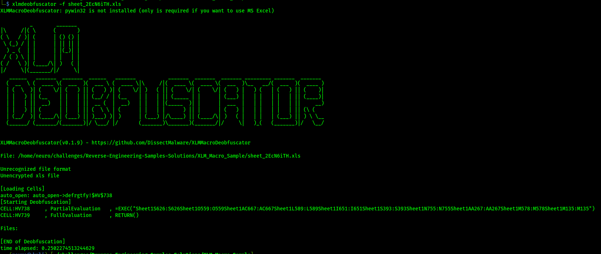
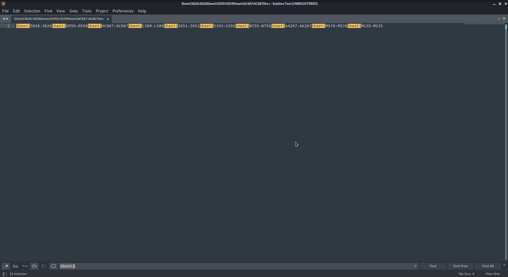
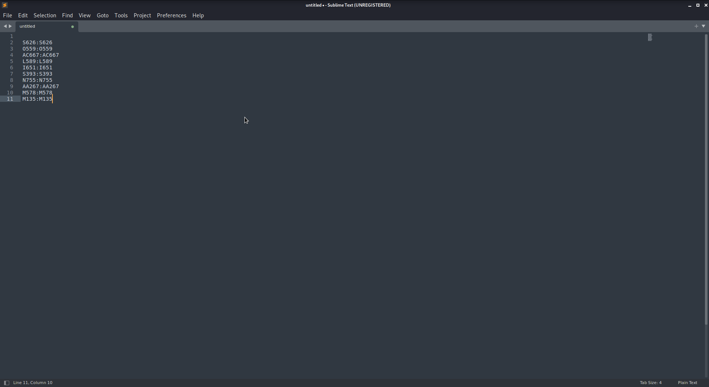
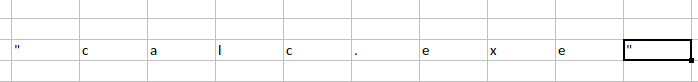

[.text-center]
Report on XLM Macro Sample

For same context we know that this sample uses XLM macros so tools such us:

- Viper Monkey
- Oledump
- Olevba

Are now useless we have to use alternative methods and tools to analyse dynamically or even statically the sample

For these tools go to Part 5(Tools)

[.text-center]
**Content:**

1. Automatic Analysis

2. Static Analysis

3. Dynamic Analysis

4. Explanation and history

5. Tools

6. Conclusion

---

[.text-center]
Part 1 (Automatic Analysis)

First things first we do a md5 and sha256 sum as file identifiers

- Md5: 77e7ddb4c3c93e6296cd2ab82a8a4400
- Sha256: 6b80ac9332ce1f9c8a6ce37666ed9884e8352c9884233fc2ee2e652762e3c242

We also use ```Hybrid-Analysis``` for our first step and get a first https://tinyurl.com/yzs2gcp5[report]

The sample is marked as `ambiguous` and possibly malicious. That happens because it uses 'vba macros'(actually it is xlm macros) to execute code on the host machine and open the `calculator.exe` app. So this is clearly a false positive but we have not seen the source code of the malware yet.

[.text-center]
Part 2 (Static Analysis)

In this section we will use ```xlmdeobfuscator``` in order to extract the malicious xlm macro code from the sample:

[source,bash]
----
xlmdeobfuscator -f sheet_2EcN6iTH.xls
----



We get this peculiar powershell like command:

[source,powershell]
----
=EXEC("Sheet1S626:S626Sheet1O559:O559Sheet1AC667:AC667Sheet1L589:L589Sheet1I651:I651Sheet1S393:S393Sheet1N755:N755Sheet1AA267:AA267Sheet1M578:M578Sheet1M135:M135")
----

Which evaluates/executes the content of some specific shells inside the excel sheet.

All the values are excel coordinates for shells inside the spread sheet.

If we use the ```=``` symbol next to a tuple of those coordinates we get a character that the malware will evaluate. Continue with each set and get the final payload







We get the final payload:

[source,powershell]
----
'calc.exe'
----

[cools="1"]
|===
|X:Y coordinates|Letter|
|S626:S626|'|
|O559:O559|c|
|AC667:AC667|a|
|L589:L589|l|
|I651:I651|c|
|S393:S393|.|
|N755:N755|e|
|AA267:AA267|x|
|M578:M578|e|
|M135:M135|'|
|===

Which calls the calculator.


[.text-center]
Part 3 Dynamic Analysis


[.text-center]
Part 5 (Tools used)

* xlmdeobfuscator (for static analysis, to dump the xlm maxros)
* Libre office (for dynamic analysis to find data of the coordinates)
* Libre office ide (To map the coordinates to real data of the payload)

[.text-center]
Part 6 (Conclusion)

Action: Not malicious, but potentially malicious